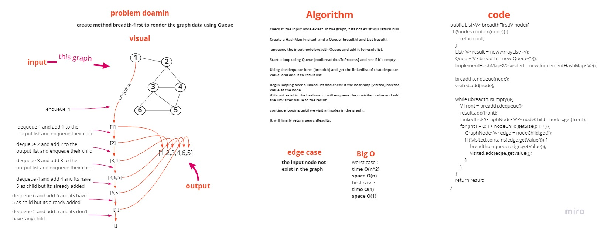

# Code Challenge: Class 36

## Challenge Summary

Implement a breadth first on a graph.

## Challenge Description

Add a breadth-first method to your graph object that receives a beginning node. Return a collection of nodes in the order they were visited without using any of your built-in functions. Showcase your collection.

## Approach & Efficiency

time O(n^2)/ space O(n)

## Solution

