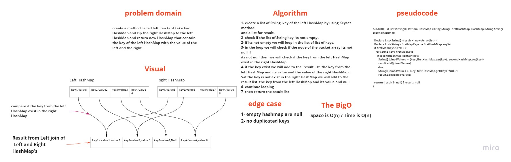

# Hash Map (code challenge -33)

# Challenge Summary
<!-- Description of the challenge -->
* create a method called left join that take two HashMap and zip the right HashMap to the left HashMap and return new HashMap that contain the key of the left HashMap with the value of the left and the right .

## Whiteboard Process
<!-- Embedded whiteboard image -->
* the test exist in LeftJoin_Test file

## Approach & Efficiency
<!-- What approach did you take? Why? What is the Big O space/time for this approach? -->
* add KeySet and contain method to the HashMap
* use KeySet to go the keys for left hashMap 
* use contain to check if the key exist in the right hashMap

* Big O ==>  space O(n)  , Time O(n)