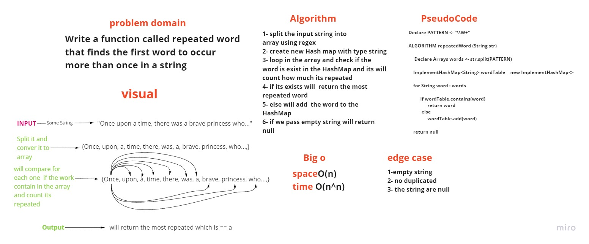

# Hash Map (code challenge -31)

# Challenge Summary
<!-- Description of the challenge -->
* Write a function called repeated word that finds the first word to occur more than once in a string

## Whiteboard Process
<!-- Embedded whiteboard image -->

## Approach & Efficiency
<!-- What approach did you take? Why? What is the Big O space/time for this approach? -->
* in side the hashmap 
1. put: incorporates both the key and the value.
2. get: returns the value from the table based on the key.

* Big O ==>  space O(n)  , Time O(n^n)

