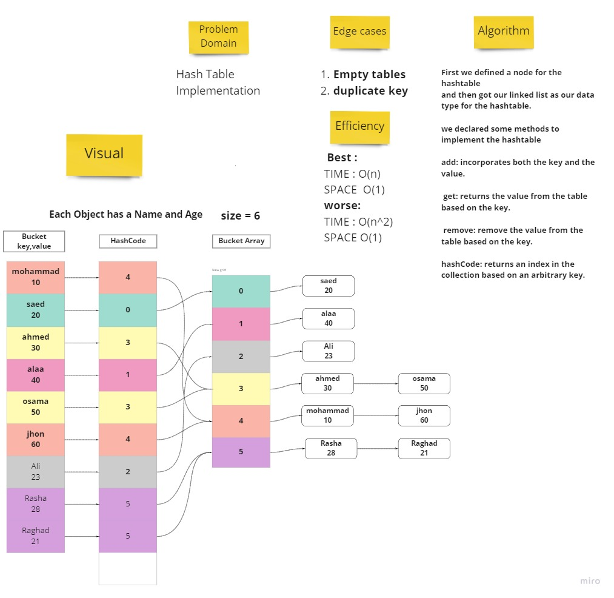
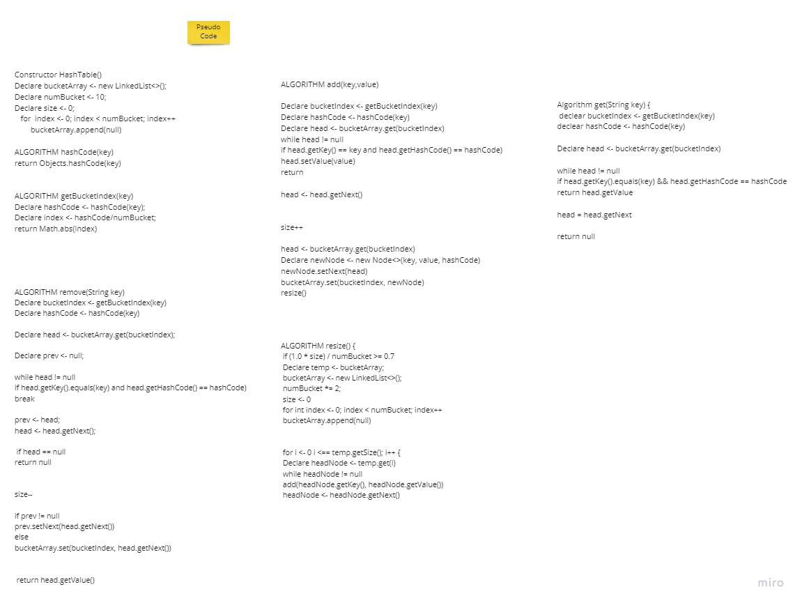

# Hashtable
<!-- Short summary or background information -->

A hash table data structure was created from the ground up.

## Challenge

implementation from scratch

## Approach & Efficiency
<!-- What approach did you take? Why? What is the Big O space/time for this approach? -->

add: incorporates both the key and the value.
get: returns the value from the table based on the key.
remove: remove the value from the table based on the key.
hashCode: returns an index in the collection based on an arbitrary key.

## API
<!-- Description of each method publicly available to your Linked List -->

* `add()` incorporates both the key and the value.
* `get()` returns the value from the table based on the key.
* `remove()` remove the value from the table based on the key.
* `hashCode()` returns an index in the collection based on an arbitrary key.
* `resize()` specify a new hash table size
* `isEmpty()` check to see if the hash table is empty or not.

## WhiteBoard

