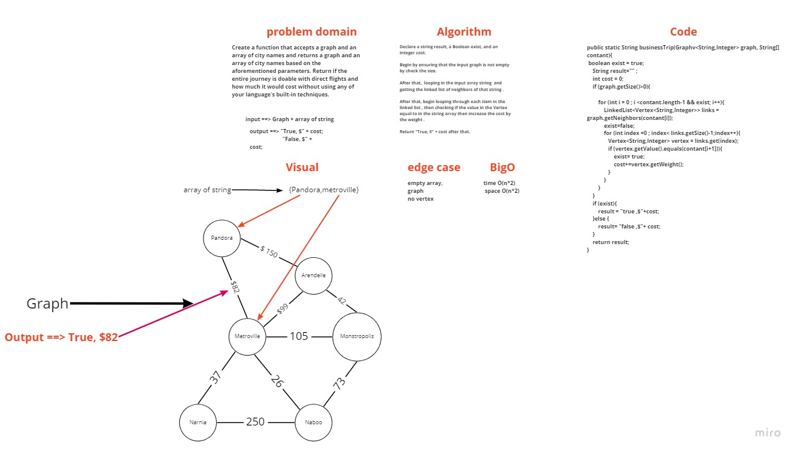

# Code Challenge: Class 37

## Challenge Summary

Is a business trip with direct flights conceivable given a schedule and a route map? If so, what will the overall cost of the trip be?

## Challenge Description

Create a function that accepts a graph and an array of city names and returns a graph and an array of city names based on the aforementioned parameters. Return if the entire journey is doable with direct flights and how much it would cost without using any of your language's built-in techniques.

## Approach & Efficiency

The Big O space is O(n) / time is O(n).

## Solution

