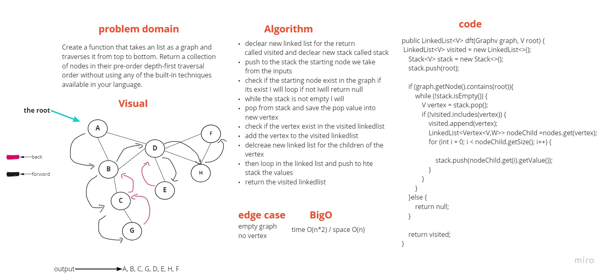

# Code Challenge: Class 38

## Challenge Summary

Create a depth first preorder on a graph.

## Challenge Description

Create a function that takes an adjacency list as a graph and traverses it from the bottom up. Return a collection of nodes in their pre-order depth-first traversal order without using any of your language's built-in functions.

## Approach & Efficiency

The Big O time is O(n*2) / space is O(n).

## Solution

