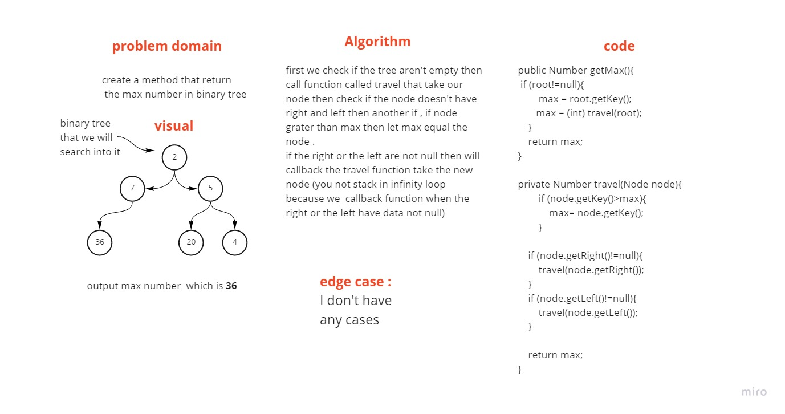
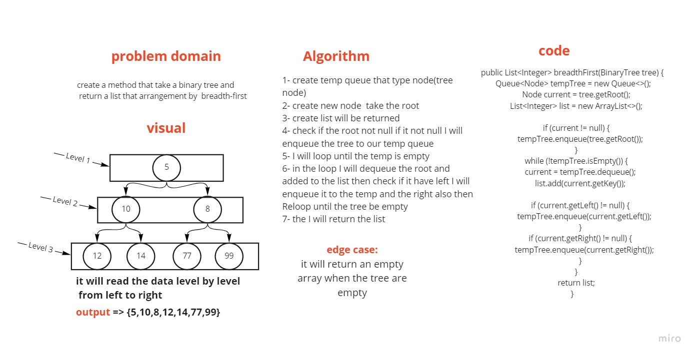

# Trees
<!-- Short summary or background information -->

## Challenge
<!-- Description of the challenge -->
- Build all trees classes and methods from scratch

## Approach & Efficiency
<!-- What approach did you take? Why? What is the Big O space/time for this approach? -->
- Create a Node class that has properties for the data stored in the QNode, the left child QNode, and the right child QNode.

- Create a BinaryTree class ,define a method for each of the depth first traversals called :
  1.inOrderTraverse
  2.postOrderTraverse
  3.preOrderTraverse  

- returns an array of the values, ordered appropriately.
  
- Create a BinarySearchTree class define a method named add that accepts a new QNode.
- add data in the correct location in the binary search tree
- define a method named contains that accepts a data, and returns a boolean indicating whether the data is in the tree at least once.

## API
<!-- Description of each method publicly available in each of your trees -->
1. Class BinaryTree

- getRoot() to get your root
- setRoot() to set your root and insert a QNode inet
- inOrderTraverse() ordered by : left-root-right
- postOrderTraverse() ordered by : root-left-right
- preOrderTraverse() ordered by : left-right-root

2. Class BinarySearchTree

- add() insert in your tree u send just data.
- traverse() get your root and start for cat in half a tree to insert your data inet
- contains() to get a boolean true or false after search in your tree
- traverseContain() reserve a root and data to start search

# Challenge Summary
<!-- Description of the challenge -->
- create a method that return the max number in binary tree

## Whiteboard Process
<!-- Embedded whiteboard image -->

## Approach & Efficiency
<!-- What approach did you take? Why? What is the Big O space/time for this approach? -->

- my approach is using recursion ,why ? because its have better Bio O and faster 
- Big O  of O(n)

## Solution
<!-- Show how to run your code, and examples of it in action --> 

1. get clone the repo 
2. cd to challenge/tree
3. gradlew run 
4. gradlew test  for GetMaxTest

# Challenge Summary
<!-- Description of the challenge -->
- create a method that return list that have the data of the tree arrangement by breadth first (by levels)

## Whiteboard Process
<!-- Embedded whiteboard image -->

## Approach & Efficiency
<!-- What approach did you take? Why? What is the Big O space/time for this approach? -->

- my approach is using Queue ,why ? because its was the best choose
- Big O  of O(n2)

## Solution
<!-- Show how to run your code, and examples of it in action --> 

1. get clone the repo
2. cd to challenge/tree
3. gradlew run
4. gradlew test  for breadthFirstTest