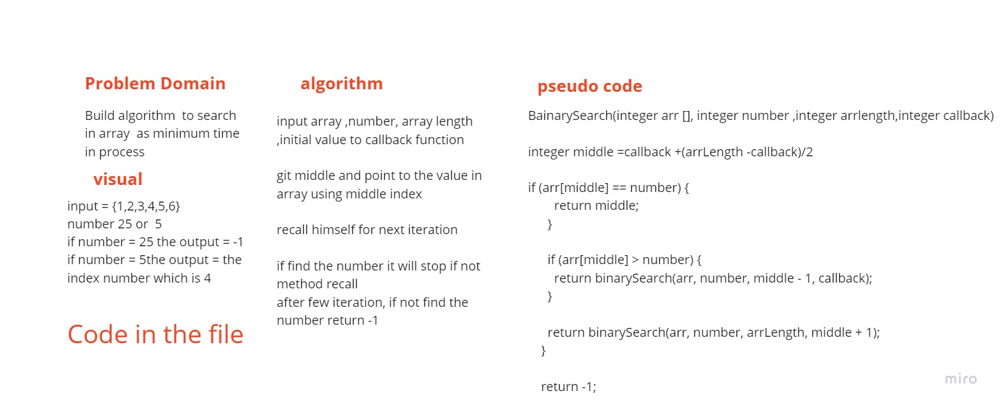

# Binary Search of Sorted Array
<!-- Description of the challenge -->
- Build algorithm  to search in array  as minimum time in process

## Whiteboard Process
<!-- Embedded whiteboard image -->

## Approach & Efficiency
<!-- What approach did you take? Discuss Why. What is the Big O space/time for this approach? -->

- I go with Binary search because is more dynamic and save some time .
