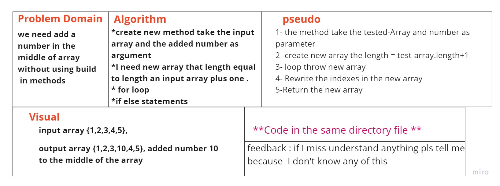

# Insert to Middle of an Array
<!-- Description of the challenge -->
The challenge i add number to middle of array without using build in methods

## Whiteboard Process
<!-- Embedded whiteboard image -->

## Approach & Efficiency
<!-- What approach did you take? Discuss Why. What is the Big O space/time for this approach? -->
make a new array have length of input array +1 then loop throw the new array and Rewrite the  number with the new number by using if else statements.
