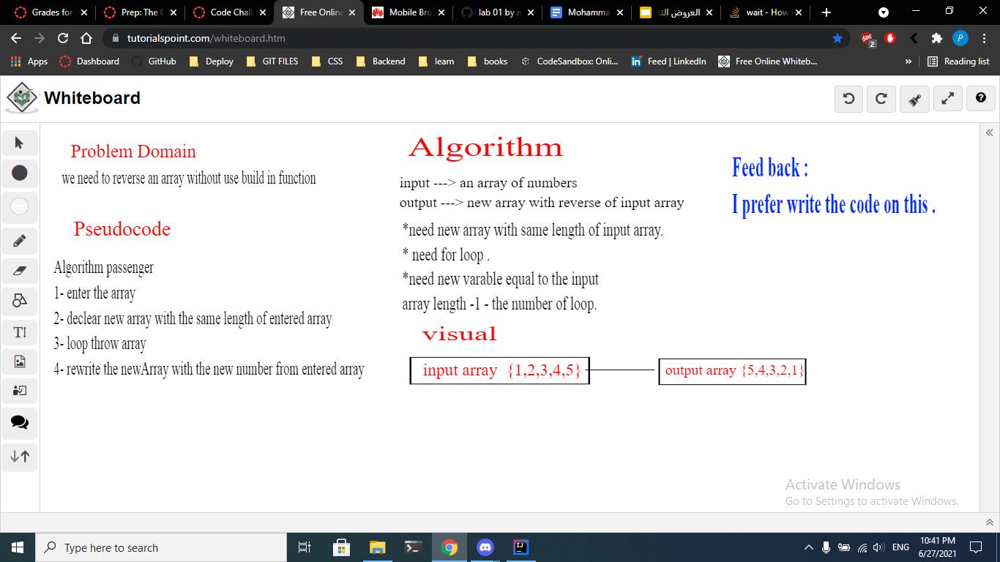

# Reverse an Array
<!-- Description of the challenge -->
- We need to reverse an array without use build in function

## Whiteboard Process
<!-- Embedded whiteboard image -->

## Approach & Efficiency
<!-- What approach did you take? Discuss Why. What is the Big O space/time for this approach? -->
- make new array with same length of the input array then loop in the input array and rewrite the new array with the new number of input array by :
``
In the for loop :

          int j=arr.length-1-i;

            int y=arr[j];

            revArr[i]=y;
            
``