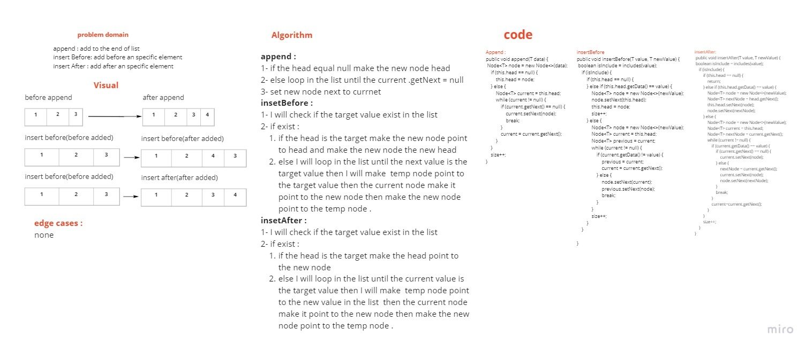
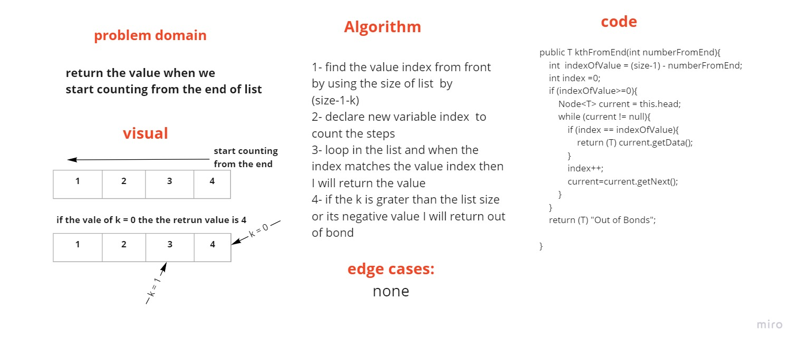

# Singly Linked List
<!-- Short summary or background information -->

## Challenge
<!-- Description of the challenge -->
- make our Linked list from the scratch.

## Approach & Efficiency
<!-- What approach did you take? Why? What is the Big O space/time for this approach? -->
- OOP Approach for flexibility and easy to read and fix.

## API
<!-- Description of each method publicly available to your Linked List -->
- add/append/insertAtEnd : add new data at the end of the list
- includes  : search the value if it exists return true else return false
- insertAfter : take two parameters the value that will insert after and the new data ,will add the new data after teh value 
- insertBefore : take two parameters the value that will insert before and the new data ,will add the new data before teh value 
- kthFromEnd : will return the value when we start count from the end
- I don't do it yet - zipLists insert in it 2 list, and it will merge them, start form list one to list two and zipListsInsert reserve each node form 2 list and start throw of list like a chain intel get end of node
- reverse  : take a linkedList and return it reversed 
- palindrome : check if the first half of the array matches the second half of the array if it matches return true else return false 
- toString : build in method to print the data in class

