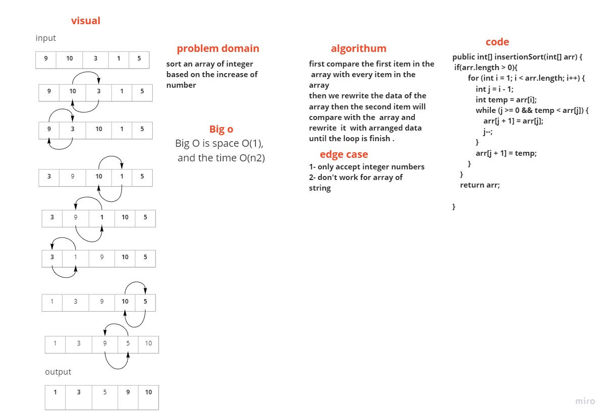

Blog

## Insertion Sort

Using insertion sort, sorts array items from least to biggest number.

Pseudocode

InsertionSort(int[] arr)

```
FOR i = 1 to arr.length

  int j <-- i - 1
  int temp <-- arr[i]
  
  WHILE j >= 0 AND temp < arr[j]
    arr[j + 1] <-- arr[j]
    j <-- j - 1
    
  arr[j + 1] <-- temp
```

## Trace

```
Sample Array: [4, 25, 30, 15, 16]
```

Pass 1

The array will be traversed first, and the numbers in the array will be compared. The array will be divided into two parts: sorted and unsorted. In the next passes, the unsorted numbers will be selected and placed in the appropriate locations.

Pass 2

The second pass will swap the 15 and the 30.

Pass 3

The second pass will swap the 15 and the 25.

Pass 4

The second pass will swap the 16 and the 25.

Pass 5

The second pass will swap the 16 and the 30.

## Efficiency

Time: O(n^2) / Space: O(1)

## WhiteBoard

