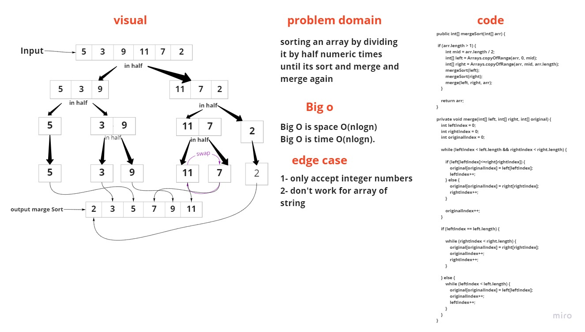
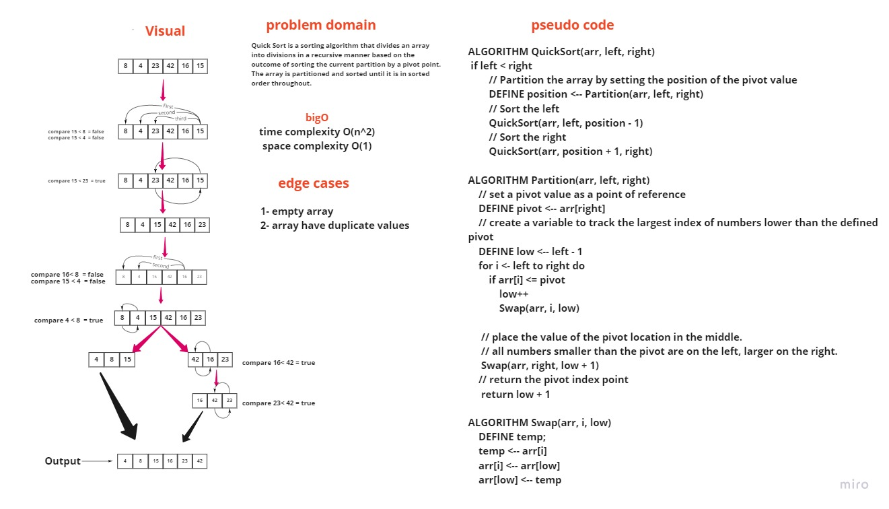

## Challenge Summary

- Solve the insertion sort puzzle and create a blog post about it.


## Challenge Description

- Step through the procedure using the given sample array to trace the method. 
- Document your reasoning by writing a blog post that includes a visual representation of the result after each iteration.
- Once you've finished your article, use the pseudocode given to create a functioning, tested version of Insertion Sort.


## Approach & Efficiency

- I started by reading the instructions and looking at the pseudocode 
- Then I prepared the files I'd require for this assignment.
- I then wrote the blog using the blog example as a guide. 
- I sketched up the blog's whiteboard and jotted down a quick rundown of the code.
- This challenge's Big O is space O(1), and the challenge's time O(n2).

**Solution**

```
Sample Array: [4, 25, 30, 15, 16]

Pass 1: [4, 25, 30, 15, 16]

Pass 2: [4, 25, 15, 30, 16]

Pass 3: [4, 15, 25, 30, 16]

Pass 4: [4, 15, 25, 16, 30]

Pass 5: [4, 15, 16, 25, 30]
```

## Challenge Summary  challenge 27

Solve the merge sort problem and blog about it.


## Challenge Description

Examine the pseudocode below, then follow the steps using the given example array to trace the method. Document your reasoning by writing a blog post that includes a visual representation of the result after each iteration. Once you've finished your article, use the pseudocode given to create a functioning, tested Merge Sort solution.


## Approach & Efficiency

I started by reading the instructions and looking at the pseudocode. Then I prepared the files I'd require for this assignment. I then wrote the blog using the blog example as a guide. I sketched up the blog's whiteboard and jotted down a quick rundown of the code. For this task, the Big O is space O(nlogn), while the Big O is time O(nlogn).

Solution



## Challenge Summary  challenge 28

Solve the merge sort problem and blog about it.


## Challenge Description

Examine the pseudocode below, then follow the steps using the given example array to trace the method. Document your reasoning by writing a blog post that includes a visual representation of the result after each iteration. Once you've finished your article, use the pseudocode given to create a functioning, tested Merge Sort solution.


## Approach & Efficiency

I started by reading the instructions and looking at the pseudocode. Then I prepared the files I'd require for this assignment. I then wrote the blog using the blog example as a guide. I sketched up the blog's whiteboard and jotted down a quick rundown of the code. For this task, the Big O is space O(nlogn), while the Big O is time O(nlogn).

Solution

