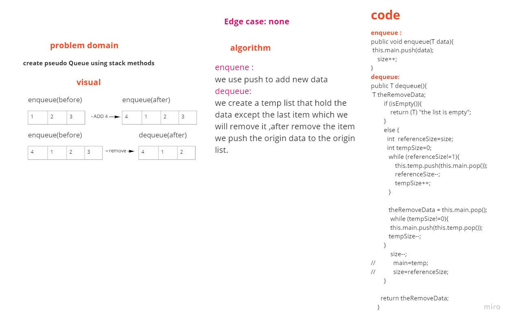
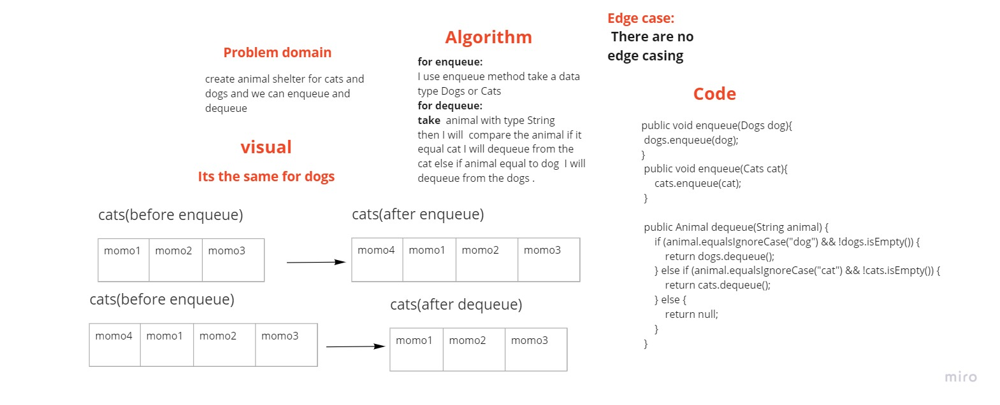
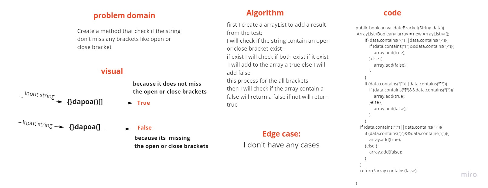
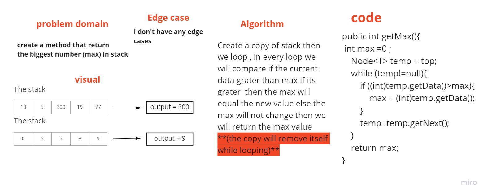

# Stacks and Queues
<!-- Short summary or background information -->
- Stacks is type of data Structure that build on stack
- Queues is type of data Structure that build on Queues
- PseudoQueue is type of data Structure that build on Queues but using stack methods

## Challenge
<!-- Description of the challenge -->
- For the Stack create the method (push,pop,peek,isEmpty)
- For the Queues create the method (enqueue,dequeue,peek,isEmpty)
- For the PseudoQueue create the method (enqueue,dequeue,isEmpty)

## Approach & Efficiency
<!-- What approach did you take? Why? What is the Big O space/time for this approach? -->
- no Big O
## API
<!-- Description of each method publicly available to your Stack and Queue-->
**stack**
1. push - add new item to the front of linkedList
2. pop - remove the last item you added
3. peek - return the value of the top of stack (the last item you added)
4. isEmpty- return true if the linkedList don't have any item else return false if it has an item

**Queues**
1. enqueue - add new item to the front of linkedList
2. dequeue - remove the  front item of linkedList
3. peek - return the value of the front of linkedList (the first item of the list)
4. isEmpty- return true if the linkedList don't have any item else return false if it has an item

**PseudoQueue**
- using stack method create an enqueue and dequeue method 

**AnimalShelter**
- add two classes Cats and Dogs that extends from animal and in the animal shutter class we create two queue with type dog and cat and enqueue and dequeue for each one 

**ValidateBrackets**
- create a method that check if the open or close bracket missing if it's missing it's will return false else return true

**Get Max Value**
- create a methode that return the max value exist in the stack 
# Whiteboard Process

